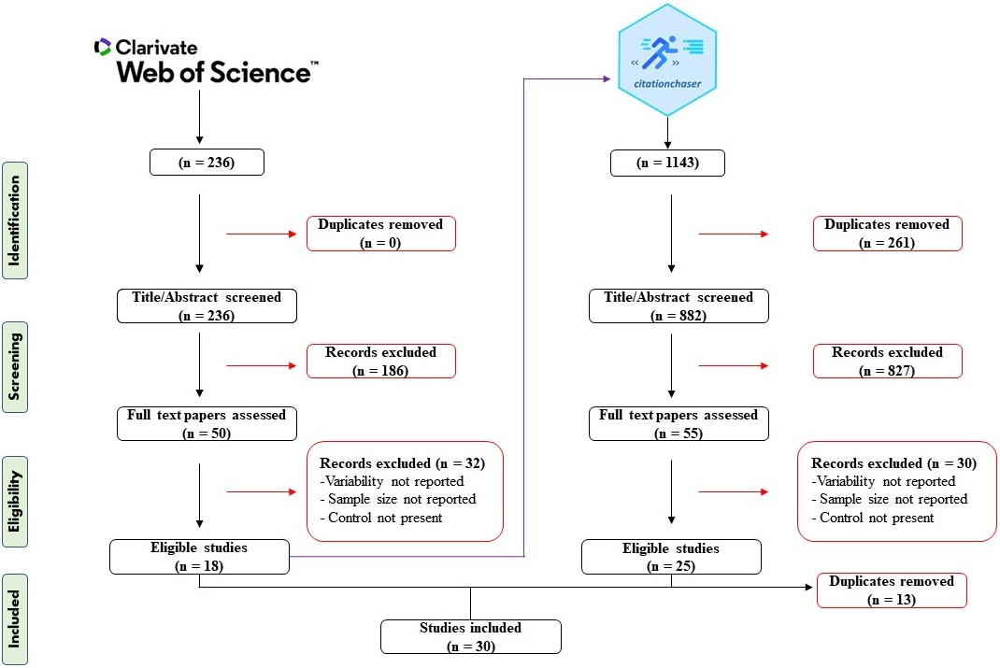

```{r setup, include = FALSE}
# kniter setting
knitr::opts_chunk$set(
  message = FALSE,
  warning = FALSE, # no warnings
  cache = TRUE,
  echo = TRUE
)
# cleaning up
 rm(list=ls())
```

# General Introduction

This supplementary material provides a step by step description and explanation of methods adopted for literature search and data-analysis, along with the results reported within the main manuscript 


# Setups

## Loading packages


```{r}

# devtools::install_github("itchyshin/orchard_plot", subdir = "orchaRd", force = TRUE, build_vignettes = TRUE)
library(pacman)
pacman::p_load(metafor, # main package for meta-analysis
               broom,
               tidyverse, 
               rmarkdown,
               readxl,
               kableExtra,  # making nice tables
               orchaRd,
               patchwork, # putting ggplots together
               sjPlot,
               gridExtra, 
               jtools,
               ggtext,
               purrr,
               metaAidR, # for VCV matrix
               corpcor,
               R.rsp,
               tibble, # nice tables
               ggpubr, # arranging multipe ggplots
               here # making reading files easy
               )
```

## Custom functions
We have adopted some of the custom functions from **[Atkinson et al., (2022)](https://doi.org/10.1111/ele.14025)** which are presented below.

```{r}

get_pred1 <- function(model, mod = " ") {
  name <- name <- firstup(as.character(stringr::str_replace(row.names(model$beta), 
                                                            mod, "")))
  len <- length(name)
  
  if (len != 1) {
    newdata <- matrix(NA, ncol = len, nrow = len)
    for (i in 1:len) {
      pos <- which(model$X[, i] == 1)[[1]]
      newdata[, i] <- model$X[pos, ]
    }
    pred <- metafor::predict.rma(model, newmods = newdata)
  } else {
    pred <- metafor::predict.rma(model)
  }
  estimate <- pred$pred
  lowerCL <- pred$ci.lb
  upperCL <- pred$ci.ub
  lowerPR <- pred$cr.lb
  upperPR <- pred$cr.ub
  
  table <- tibble(name = factor(name, levels = name, labels = name), estimate = estimate, 
                  lowerCL = lowerCL, upperCL = upperCL, pval = model$pval, lowerPR = lowerPR, 
                  upperPR = upperPR)
}


mod_tab<-function(m){
# getting marginal R2
  
r2 <- r2_ml(m)

# creating a table
tibble(`Fixed effect` = row.names(m$beta), Estimate = c(m$b), 
       `Lower CI [0.025]` = c(m$ci.lb), `Upper CI  [0.975]` = c(m$ci.ub), 
       `P value` = c(m$pval), R2 = c(r2[1],        rep(NA, (length(m$beta)-1)))) %>% kable("html", digits = 3) %>% kable_styling("striped", position = "left") 
}

uni_mod_plot<-function(m, df, log_ratio, response, variance){
p <- predict.rma(m)
df %>% mutate(ymin = p$ci.lb, 
                                                  ymax = p$ci.ub, ymin2 = p$cr.lb, 
                                                  ymax2 = p$cr.ub, pred = p$pred) %>% 
  ggplot(aes(x = response, y = log_ratio, size = sqrt(1/variance))) + geom_point(shape = 21, alpha= 0.2,
                                                                     fill = "grey90") + 
  geom_hline(yintercept = 0, size = .5, colour = "gray70")+
  geom_smooth(aes(y = ymin2), method = "lm", se = FALSE, lty = "solid", lwd = 0.75, 
              colour = "#0072B2") + geom_smooth(aes(y = ymax2), method = "lm", se = FALSE, 
                                                lty = "solid", lwd = 0.75, colour = "#0072B2") + geom_smooth(aes(y = ymin), 
                                                                                                              method = "lm", se = FALSE, lty = "solid", lwd = 0.75, colour = "#D55E00") + 
  geom_smooth(aes(y = ymax), method = "lm", se = FALSE, lty = "solid", lwd = 0.75, 
              colour = "#D55E00") + geom_smooth(aes(y = pred), method = "lm", se = FALSE, 
                                                lty = "solid", lwd = 1, colour = "black") +           
  theme_classic() + theme(legend.position = c(0, 1), legend.justification = c(0, 1)) + theme(legend.direction = "horizontal") + 
  theme(legend.background = element_blank()) + theme(axis.text.y = element_text(size = 8, 
                                                                                colour = "black", hjust = 0.5, angle = 90))+
  coord_cartesian(ylim = c(-2.5, 2.5))+
  scale_y_continuous(limits = c(-2.5, 2.5),
                     breaks = c(-2, -1, 0, 1, 2),
                     labels = c("\n \n -2", "100% decrease \n \n -1", "\n \n 0.0", "100% increase \n \n 1", "\n \n2")) +
  theme(legend.position = "none") 
}


I2 <- function(model, method = c("Wolfgang", "Shinichi")) {
    
    ## evaluate choices
    method <- match.arg(method)
    
    # Wolfgang's method
    if (method == "Wolfgang") {
        W <- solve(model$V)
        X <- model.matrix(model)
        P <- W - W %*% X %*% solve(t(X) %*% W %*% X) %*% t(X) %*% W
        I2_total <- sum(model$sigma2)/(sum(model$sigma2) + (model$k - model$p)/sum(diag(P)))
        I2_each <- model$sigma2/(sum(model$sigma2) + (model$k - model$p)/sum(diag(P)))
        names(I2_each) = paste0("I2_", model$s.names)
        
        # putting all together
        I2s <- c(I2_total = I2_total, I2_each)
        
        # or my way
    } else {
        # sigma2_v = typical sampling error variance
        sigma2_v <- sum(1/model$vi) * (model$k - 1)/(sum(1/model$vi)^2 - sum((1/model$vi)^2))
        I2_total <- sum(model$sigma2)/(sum(model$sigma2) + sigma2_v)  #s^2_t = total variance
        I2_each <- model$sigma2/(sum(model$sigma2) + sigma2_v)
        names(I2_each) = paste0("I2_", model$s.names)
        
        # putting all together
        I2s <- c(I2_total = I2_total, I2_each)
    }
    return(I2s)
}

uni_mod_plot_ns<-function(m, df, log_ratio, response, variance){
p <- predict.rma(m)
df %>% mutate(ymin = p$ci.lb, 
                                                  ymax = p$ci.ub, ymin2 = p$cr.lb, 
                                                  ymax2 = p$cr.ub, pred = p$pred) %>% 
  ggplot(aes(x = response, y = log_ratio, size = sqrt(1/variance))) + geom_point(shape = 21, alpha= 0.2,
                                                                     fill = "grey90") + 
  geom_hline(yintercept = 0, size = .5, colour = "gray70")+
  geom_smooth(aes(y = ymin2), method = "lm", se = FALSE, lty = "dashed", lwd = 0.75, 
              colour = "#0072B2") + geom_smooth(aes(y = ymax2), method = "lm", se = FALSE, 
                                                lty = "dashed", lwd = 0.75, colour = "#0072B2") + geom_smooth(aes(y = ymin), 
                                                                                                              method = "lm", se = FALSE, lty = "dashed", lwd = 0.75, colour = "#D55E00") + 
  geom_smooth(aes(y = ymax), method = "lm", se = FALSE, lty = "dashed", lwd = 0.75, 
              colour = "#D55E00") + geom_smooth(aes(y = pred), method = "lm", se = FALSE, 
                                                lty = "dashed", lwd = 1, colour = "black") + 
  theme_classic() + theme(legend.position = c(0, 1), legend.justification = c(0, 1)) + theme(legend.direction = "horizontal") + 
  theme(legend.background = element_blank()) + theme(axis.text.y = element_text(size = 8, 
                                                                                colour = "black", hjust = 0.5, angle = 90))+
  coord_cartesian(ylim = c(-2.5, 2.5))+
  scale_y_continuous(limits = c(-2.5, 2.5),
                     breaks = c(-2, -1, 0, 1, 2),
                     labels = c("\n \n -2", "100% decrease \n \n -1", "\n \n 0.0", "100% increase \n \n 1", "\n \n2")) +
  theme(legend.position = "none") 
}

```


# Literature search

The detailed information on the literature search is already presented in the main body of the manuscript However, a brief overview is presented here.

Our aim was to conduct a comprehensive search for studies evaluating the ecological impacts of *Lantana camara* invasion by comparing invaded and uninvades sites.  For this, we first performed a systematic search for published literature using the Web of Science (WoS) core collection database on 10 October, 2021  (Timespan: all years). We screened the retrieved literature for duplicates and irrelevant titles and abstracts using the revtools package **[(Westgate, 2019)](https://doi.org/10.1002/jrsm.1374)**. Second, using the included articles from WoS as seed, we searched backward references and forward citations of these selected articles on 18 October, 2021, with the help of citationchaser package **[(Haddaway et al., 2022)](https://doi.org/10.1002/jrsm.1563)** to identify additional articles that might have been missed in the main database search. The details of the key word combination and the Boolean operators included in search string for WoS is shown below, along with a flow diagram (often referred to as a PRISMA flow chart: Figure 1) which shows the numbers of articles retrieved during the literature search and those included as well as excluded at each stage of screening process.
All screening was performed by the lead author **RA**.

 **Web of Science Core Collection:**
  
TS=(("*Lantana camara*" OR "Spanish flag" OR "red-sage" OR "red sage") AND ("inva\*") AND ("impact\*" OR "effect\*" OR "modif\*" OR "change\*" OR "influence\*") AND ("richness" OR "diversity" OR "community structure\*" OR "community assemblage\*" OR "ecosystem structure" OR "ecosystem function\*" OR "population\*" OR "composition\*" OR "ecosystem process\*" OR "ecosystem pool\*" OR "ecosystem flux\*" OR "competition\*" OR "evenness" OR "biodiversity" OR "biological diversity" OR "abundance\*" OR "biomass" OR "producti\*" OR "growth" OR "cover" OR "densit\*" OR "species abundance distribution\*" OR "biogeochemical" OR "nutrient cycl\*" OR "cycling of nutrient\*" OR "nutrient dynamics" OR "nutrient flux\*" OR "nutrient pool\*" OR "flux\* of nutrient\*" OR "carbon" OR "nitrogen" OR "phosphorous" OR "pH" OR "organic matter" OR "decomposition" OR "litter" OR "soil" OR "hydrolog\*" OR "water" OR "resource\*"))
  
We followed reporting guidelines outlined in the PRISMA-EcoEvo checklist **[(O'Dea et al., 2021)](https://doi.org/10.1111/brv.12721)**.

**Figure 1 (main manuscript).** PRISMA diagram summerizing the screening process along with reasons for excluding studies.

## The *Lantana* invasion impact dataset

### Table of the dataset

Below is presented the dataset used for our meta-analysis, followed by explanations of the variables extracted from the papers included (variables not included in our meta-analysis as shown by *).

```{r data-set}
# getting the data into R emvironment
full_data<- read.csv("data/LC_data_extracted.csv")

# making a scrollable table of dataset
kable(full_data, "html") %>%
 kable_styling("striped", position = "left") %>%
 scroll_box(width = "850px", height = "300px")
```

`Citation*`:  Reference of the paper included.

`PR_ID`: Unique ID for each paper included.

`Year`: Publication year of paper.

`ES_ID`: Unique ID for each row of data (i.e., effect size or observation).

`CHT_ID`: Unique ID for each cohort (i.e., observation from same experimental plot or location).

`Ecosystem_type`: Ecosystem were study was conducted.

`Longitude`: Longitude of the location were study was conducted.

`Latitude`: Latitude of the location were study was conducted.

`Study_design`: Method of performing the study (i.e., Observational or experimental).

`Continent`: Name of the continent in which the study was carried out.

`Region*`: Name of the locality in which the study was carried out.

`Country*`: Name of the country in which the study was carried out.

`Climat_type*`: Main climate of the region in which the study was carried out.

`Source*`: Location in the paper where from the data was collected (i.e., Text, Table or Figure).

`Variable*`: Name of the parameter for which data was extracted.

`Impact_type`: Classification of the parameter (i.e. variables) into broader response class.

`Level_ecological_organization`: Classification of the parameter (i.e. variables) based on hierarchy.

`nT`: Sample size in the treatment (i.e., invaded) plot.

`mT`: Mean value of variable in the treatment (i.e., invaded) plot.

`sdT`: Standard deviation of variable in the treatment (i.e., invaded) plot.

`nC`: Sample size in the control (i.e., uninvaded) plot.

`mC`: Mean value of variable in the control (i.e., uninvaded) plot.

`sdC`: Standard deviation of variable in the control (i.e., uninvaded) plot.

`num.shared.control`: Number of times the control was shared in the study.

`N.control.sc`: Modified sample size for the control plot to account for the shared control dependence (calculated by dividing overall sample size for the shared control group by the total number of shared controls).

### Levels of Ecological organization and response classes
We classified each of the ecological variable into three levels of ecological organization based on whether impacts are related to species, resident communities, or ecosystem properties and functioning. Also, we categorized the studied variables into 25 response classes (i.e., impact types) modified after **[Vila et al. (2011)](https://doi.org/10.1111/j.1461-0248.2011.01628.x)** and **[Cameron et al. (2016)](https://doi.org/10.1111/geb.12436)** (see Table S1 below). 

**Table S1**: Categorization of the studied variables into 25 response classes (impact types) and three levels of ecological organization. 
```{r}
# getting the data into R emvironment
response_classes <- read.csv("data/Response_classes.csv")

# making a scrollable table of dataset
kable(response_classes, "html") %>%
 kable_styling("striped", position = "left") %>%
 scroll_box(width = "850px", height = "300px")
```


### Counting observations
The below tables summarize the number of observations according to different variables (factors) studied. 

**Table S2**: Number of observations by continent.
```{r}
full_data %>% group_by(Continent) %>% summarise(n()) %>% rename(`Number of observations` = `n()`) %>% kable("html")  %>% 
  kable_styling("striped", position = "left")%>%
  scroll_box(width = "850px", height = "200px")
```

**Table S3**: Number of observations by ecosystem type.
```{r}
full_data %>% group_by(Ecosystem_type) %>% summarise(n()) %>% rename(`Ecosystem` = Ecosystem_type, `Number of observations` = `n()`) %>% kable("html")  %>% 
  kable_styling("striped", position = "left")%>%
  scroll_box(width = "850px", height = "200px")
```

**Table S4**: Number of observations by response class (i.e., impact type).
```{r}
full_data %>% group_by(Impact_type) %>% summarise(n()) %>% rename(`Response class` = Impact_type, `Number of observations` = `n()`) %>% kable("html")  %>% 
  kable_styling("striped", position = "left")%>%
  scroll_box(width = "850px", height = "200px")
```

**Table S5**: Number of observations by levels of ecological organization.
```{r}
full_data %>% group_by(Level_ecological_organization) %>% summarise(n()) %>% rename(`Level of ecological organization` = Level_ecological_organization, `Number of observations` = `n()`) %>% kable("html")  %>% 
  kable_styling("striped", position = "left")%>%
  scroll_box(width = "850px", height = "150px")
```

## Choosing the appropriate effect size statistics: checking the mean-variance relationship
In order to choose the appropriate effect size statistic, We checked the `mean-variance relationship` in our data. Relevant to mention that the data has not been filtered to the extent that we have used in the below shown meta-analyses, but is simply used here to demonstrate whether any mean-variance relationships exist. If there is an indication of such a relationship, it is better to use the `logarithm of response ratio (i.e., lnRR)` to study the mean effect rather than the standardized mean difference (i.e., Cohen's d or Hedges' g) because the latter assumes the homogeneity of variance and the `log coefficient of variation ratio (i.e., lnCVR)` to evaluate the variability effect.

```{r fig.width=10, width = "100%"}
# First, clean up the data
data_t<-full_data %>% filter(sdT != 0)
data_c<-full_data %>% filter(sdC != 0)

cor_t <- round(with(data_t,cor(log(mT), log(sdT))), 3)
cor_c <- round(with(data_c,cor(log(mC), log(sdC))), 3)

plot_t <- ggplot(data_t, aes(log(mT), log(sdT))) +
  geom_point(color = "#66C2A5", size = 1.5) +
  geom_smooth(method = "lm", se = FALSE, color="black") + 
  labs(x = "ln(mean[invaded])", 
       y = "ln(SD[invaded])") + 
  annotate('text',x = 7.5, y = -8, label = paste("r = ", cor_t)) +
  theme_classic()

plot_c <- ggplot(data_c, aes(log(mC), log(sdC))) +
  geom_point(color = "#FC8D62", size = 1.5) +
  geom_smooth(method = "lm", se = FALSE, color="black") + 
  labs(x = "ln(mean[Control])", 
       y = "ln(SD[Control])") + 
  annotate('text',x = 7.5, y = -8, label = paste("r = ", cor_c)) +
  theme_classic()
ggarrange(plot_t, plot_c, ncol = 2, nrow = 1, labels = c("a", "b"))

```
**Figure S1.** Correlations between mean and variance in the treatment (invaded) (a) and control (uninvaded) (b) sites.

# Meta-analyses
## Calculating effect sizes
Since we found stronger mean variance relationship on the log scale above, so instead, we used the `log of the coefficient of variation ratio (lnCVR)` to report variability and the `log response ratio (lnRR)` to compare mean effects.

We calculated the effect sizes using `escalc` function in `metafor` package **[(Viechtbauer, 2010)](https://doi.org/10.18637/jss.v036.i03)**. Here we used the treatment (invaded) as the numerator and control (uninvaded) as denominator. We also make use of the `make_VCV_matrix` function from the `metaAidR` package to calculate the variance-covariance matrix assuming a correlation of 0.5 for use in the model instead of the error term `vi` to overcome the dependence of sampling errors resulting from multiple outcomes **[(Noble et al., 2017)](https://doi.org/10.1111/mec.14031)**. The reason for this is that when more than one effect size is reported from the same experimental unit (cohort) (i.e., different biodiversity metrics measured in the same quadrat or different nutrients estimated from the same soil sample), the sampling error of these effect sizes will be correlated. Also, in cases where more than one treatment groups are compared to the same control group, the sampling error of the effect sizes is considered to be correlated. To overcome the dependence of sampling errors arising from shared control problem, we calculated  a modified sample size (n) for shared control groups by dividing the original sample size of the control group by the number of shared controls and used the modified sample size for effect size calculation **[(Higgins et al., 2019)](https://training.cochrane.org/handbook/archive/v6)**.

```{r}

# import the data file
data_all <- read.csv("data/LC_data_extracted.csv")

#remove cases where control SD = 0,  that usually results in having vi=NA 
data_all<-data_all %>% filter(sdC != 0)

# Effect size calculation
# Calculating lnRR: shared control

data.all.lnRR.sc<-escalc(measure="ROM", 
                            n1i=nT, n2i=N.control.sc, 
                            m1i=mT, m2i=mC, 
                            sd1i=sdT, sd2i=sdC,
                            data=data_all,
                            var.names=c("lnRR","lnRR.sv"), add.measure=FALSE,
                            append=FALSE)


# Calculating lnCVR: shared control
data.all.lnCVR.sc<-escalc(measure="CVR", 
                             n1i=nT, n2i=N.control.sc, 
                             m1i=mT, m2i=mC, 
                             sd1i=sdT, sd2i=sdC,
                             data=data_all,
                             var.names=c("lnCVR","lnCVR.sv"), add.measure=FALSE,
                             append=FALSE)

#combined effect sizes with original data frame

# make vcv matrix with 0.5 correlation
data_es <-bind_cols(data_all, data.all.lnRR.sc, data.all.lnCVR.sc)

data_es_rr <- data_es[order(data_es$CHT_ID), ]
vcv_RR_0.5 <- make_VCV_matrix(data = data_es_rr, V = "lnRR.sv",
                                      cluster = "CHT_ID", obs = "ES_ID",
                                      type = "vcv", rho = 0.5)
# is.positive.definite(vcv_RR_0.5) #TRUE

#remove studies that have lnCVR.sv=NA - usually where control SD = 0
data_es_cvr<-data_es %>% filter(!is.na(lnCVR.sv))
data_es_cvr <- data_es_cvr[order(data_es_cvr$CHT_ID), ]
vcv_CVR_0.5 <- make_VCV_matrix(data = data_es_cvr, V = "lnCVR.sv",
                                      cluster = "CHT_ID", obs = "ES_ID",
                                      type = "vcv", rho = 0.5)
# is.positive.definite(vcv_RR_0.5) #TRUE

```
# Meta-analytic models: lnRR and lnCVR
We conducted multilevel meta-analytic models (i.e. intercept only models) using the `rma.mv` function from the `metafor` package **[(Viechtbauer, 2010)](https://doi.org/10.18637/jss.v036.i03)**. The `rma.mv`function allows us to incorporate variance-covariance matrices in the `V` term. We fitted two random effects i.e. `effect size ID` (ES_ID)  to measure the residual heterogeneity and `study ID` (PR_ID) to account for non-independence of multiple effect sizes originating within the same study.

```{r}

# for mean effect
lnRR_full <- rma.mv(lnRR, vcv_RR_0.5, random = list(~1 | PR_ID, ~1 | ES_ID), method = "REML", data = data_es_rr)

lnCVR_full <- rma.mv(lnCVR, vcv_CVR_0.5, random = list(~1 | PR_ID, ~1 | ES_ID), method = "REML", data = data_es_cvr)

```

**Table S6:** Overall mean and variability effects along with 95% confidence intervals (CIs) and 95% prediction intervals (95%). lnRR = log response ratio and lnCVR = log CV ratio (coefficient of variation).

```{r}
# getting a table of CI and PI

pred_rr <- get_pred1(lnRR_full, mod = "Int")
pred_cvr <- get_pred1(lnCVR_full, mod = "Int")

# Drawing a table for meta-analyses
tibble(`Effect size` = c("lnRR", "lnCVR"), 
       `Overall mean` = c(pred_rr$estimate, pred_cvr$estimate), 
       `Lower CI [0.025]` = c(pred_rr$lowerCL, pred_cvr$lowerCL), 
       `Upper CI [0.975]` = c(pred_rr$upperCL, pred_cvr$upperCL),
       `P value`          = c(pred_rr$pval, pred_cvr$pval),
       `Lower PI [0.025]` = c(pred_rr$lowerPR, pred_cvr$lowerPR), 
       `Upper PI [0.975]` = c(pred_rr$upperPR, pred_cvr$upperPR)) %>% 
  kable("html", digits = 3) %>% 
  kable_styling("striped", position = "left")%>%
    scroll_box(width = "830px", height = "160px")
```


**Table S7:** Heterogeneity among the effects for multilevel intercept-only meta-analytic models, measured using *I*^2^.


```{r}
# estimating I2 as measure of heterogeneity in percentage
Mean<-round(I2(lnRR_full)* 100, 2)
Variability<-round(I2(lnCVR_full)* 100, 2)

tbl<-rbind(Mean, Variability)
tbl<-as.data.frame(tbl)
tbl$Model<-c("lnRR", "lnCVR")
tbl %>% rename(`I^2^~[total]~` = I2_total, `I^2^~[study]~` = I2_PR_ID, `I^2^~[effect size]~` = I2_ES_ID)%>%
                 kable("html", digits = 4) %>% 
                 kable_styling("striped", position = "left")
```


### Meta-analytic models: plots
```{r fig.height=4, fig.width=8, cache=TRUE}
# drawing plots for multilevel meta-analytic models (intercept only)

p1 <- orchard_plot(lnRR_full, mod="Int", xlab = "log(Response ratio) (lnRR)", alpha = 0.5, k = F) +
  scale_y_discrete(labels = "Overall") + 
  scale_fill_manual(values="aquamarine") +
  scale_colour_manual(values="aquamarine") +
  coord_cartesian(xlim = c(-3, 3)) + theme(legend.position = "none")+
  geom_richtext(x = 2,
           y = 0.7,
           label = paste('<i>N<sub>effect size</i> =', lnRR_full$k.all), size =3, label.size  = NA)
 

p2 <- orchard_plot(lnCVR_full, mod="Int", xlab = "log(CV ratio) (lnCVR)", alpha = 0.1, k=F) +
  scale_y_discrete(labels = "Overall") +
  scale_fill_manual(values="red") +
  scale_colour_manual(values="red") +
  coord_cartesian(xlim = c(-3, 3))+ theme(legend.position = "none")+
  geom_richtext(x = 2,
           y = 0.7,
           label = paste('<i>N<sub>effect size</i> =', lnCVR_full$k.all), size =3, label.size  = NA)


fig<-p1/p2 + plot_annotation(tag_prefix = "(", tag_levels = "a", tag_suffix = ")")
fig

```

**Figure 2 (main manuscript).** Meta-analytic model comparing the mean (lnRR) (a) and variability (lnCVR) (b) of ecological variables in *Lantana camara* invaded sites with control (uninvaded) sites. Shown are the model estimated means (central points), along with thick 95% confidence intervals (thick bars - indicating uncertainty around the overall estimate), and 95% prediction intervals (thin bars - indicating the predicted range for 95% of new or simply not included effect sizes). Each of the background point represents an effect size, with its size proportional to the precision of its estimate (1/SE).

# Meta-regression models: lnRR and lnCVR
We carried a series of univariate meta-regression models for each of the following moderators to test our research questions: **(a)**`Response class (i.e., impact type)`, **(b)** `Level_ecological_organization`, **(c)** `Ecosysyem_type`, **(d)** `Continent`, **(e)** `Study_design` and **(f)** `Latitude`. Simply, these moderators help us to investigate whether the *Lantana camara* associated impacts varies with different variables, and also allow us to estimate the invasion effects associated with different levels of these factors.

## Moderator: Impact type 
```{r, fig.width=10, fig.height=12}

# Moderator: impact type1 

lnRR_full_impact_type <- rma.mv(yi = lnRR, V = vcv_RR_0.5, mods = ~Impact_type -1, 
                                 random = list(~1 | PR_ID, ~1 | ES_ID), method = "REML", data = data_es_rr)

lnCVR_full_impact_type <- rma.mv(yi = lnCVR, V = vcv_CVR_0.5, mods = ~Impact_type -1, 
                                 random = list(~1 | PR_ID, ~1 | ES_ID), method = "REML", data = data_es_cvr)

# modify orchard_plot function to paste N instead of K

orchard_plot<-function (object, mod = "Int", xlab, N = "none", 
    alpha = 0.1, angle = 90, cb = TRUE, k = TRUE, transfm = c("none", 
        "tanh")) 
{
    transfm <- match.arg(transfm)
    if (any(class(object) %in% c("rma.mv", "rma"))) {
        if (mod != "Int") {
            object <- mod_results(object, mod)
        }
        else {
            object <- mod_results(object, mod = "Int")
        }
    }
    mod_table <- object$mod_table
    data <- object$data
    data$moderator <- factor(data$moderator, levels = mod_table$name, 
        labels = mod_table$name)
    data$scale <- (1/sqrt(data[, "vi"]))
    legend <- "Precision (1/SE)"
    if (any(N != "none")) {
        data$scale <- N
        legend <- "Sample Size (N)"
    }
    if (transfm == "tanh") {
        cols <- sapply(mod_table, is.numeric)
        mod_table[, cols] <- Zr_to_r(mod_table[, cols])
        data$yi <- Zr_to_r(data$yi)
        label <- xlab
    }
    else {
        label <- xlab
    }
    mod_table$K <- as.vector(by(data, data[, "moderator"], 
        function(x) length(x[, "yi"])))
    group_no <- nrow(mod_table)
    cbpl <- c("#E69F00", "#009E73", "#F0E442", 
        "#0072B2", "#D55E00", "#CC79A7", "#56B4E9", 
        "#999999")
    plot <- ggplot2::ggplot(data = mod_table, aes(x = estimate, 
        y = name)) + ggbeeswarm::geom_quasirandom(data = data, 
        aes(x = yi, y = moderator, size = scale, colour = moderator), 
        groupOnX = FALSE, alpha = alpha) + ggplot2::geom_errorbarh(aes(xmin = lowerPR, 
        xmax = upperPR), height = 0, show.legend = FALSE, size = 0.5, 
        alpha = 0.6) + ggplot2::geom_errorbarh(aes(xmin = lowerCL, 
        xmax = upperCL), height = 0, show.legend = FALSE, size = 1.2) + 
        ggplot2::geom_vline(xintercept = 0, linetype = 2, colour = "black", 
            alpha = alpha) + ggplot2::geom_point(aes(fill = name), 
        size = 3, shape = 21) + ggplot2::theme_bw() + ggplot2::guides(fill = "none", 
        colour = "none") + ggplot2::theme(legend.position = c(1, 
        0), legend.justification = c(1, 0)) + ggplot2::theme(legend.title = element_text(size = 9)) + 
        ggplot2::theme(legend.direction = "horizontal") + 
        ggplot2::theme(legend.background = element_blank()) + 
        ggplot2::labs(x = label, y = "", size = legend) + 
        ggplot2::theme(axis.text.y = element_text(size = 10, 
            colour = "black", hjust = 0.5, angle = angle))
    if (cb == TRUE) {
        plot <- plot + scale_fill_manual(values = cbpl) + scale_colour_manual(values = cbpl)
    }
    if (k == TRUE) {
        plot <- plot + ggplot2::annotate("text", x = (max(data$yi) + 
            (max(data$yi) * 0.1)), y = (seq(1, group_no, 1) + 
            0.3), label = paste("italic(N)==", mod_table$K), 
            parse = TRUE, hjust = "right", size = 3.5)
    }
    return(plot)
}

# drawing the plots

pl1<-orchard_plot(lnRR_full_impact_type, mod = "Impact_type", alpha = 0.08, angle = 45, cb = FALSE, xlab = "log(Response ratio) (lnRR)")+ theme(legend.position = "none")
  

pl2<-orchard_plot(lnCVR_full_impact_type, mod = "Impact_type", alpha = 0.08,angle = 45, cb = FALSE, xlab = "log(CV ratio) (lnCVR)")+ theme(legend.position = "none")
  

(pl1| pl2) +plot_annotation(tag_prefix = "(", tag_levels = "a", tag_suffix = ")")

```
**Figure 3 (main manuscript).** Orchard plots showing the mean and variability effects of *Lantana camara* invasion  relative to uninvaded condition using `response class` as a moderator.

```{r}

# getting marginal R2

r2_lnRR_full_impact_type <- r2_ml(lnRR_full_impact_type)
r2_lnCVR_full_impact_type <- r2_ml(lnCVR_full_impact_type)
```

**Table S8.** Regression coefficients (Estimate) with 95% confidence intervals (CIs), and significance levels from the meta-regression model with `response class` as moderator. *R^2^~marginal~* = 32.59% and 11.11% for lnRR and lnCVR respectively.

```{r}
# getting prediction intervals
res_lnRR_full_impact_type <- get_pred1(lnRR_full_impact_type, mod = "Impact_type")
res_lnCVR_full_impact_type <- get_pred1(lnCVR_full_impact_type, mod = "Impact_type")

r2_lnRR_full_impact_type <- r2_ml(lnRR_full_impact_type)
r2_lnCVR_full_impact_type <- r2_ml(lnCVR_full_impact_type)

# creating table
im<-tibble(`Term` = c(as.character(res_lnRR_full_impact_type$name), as.character(res_lnCVR_full_impact_type$name)), 
       `Estimate` = c(res_lnRR_full_impact_type$estimate, res_lnCVR_full_impact_type$estimate), 
       `Lower CI [0.025]` = c(res_lnRR_full_impact_type$lowerCL, res_lnCVR_full_impact_type$lowerCL),
       `Upper CI [0.975]` = c(res_lnRR_full_impact_type$upperCL, res_lnCVR_full_impact_type$upperCL),
       `P value`          = c(res_lnRR_full_impact_type$pval, res_lnCVR_full_impact_type$pval))
names<-c("lnRR", "lnCVR")  
im1<-im %>% mutate(Model = rep(names, times = c(25,25))) %>% select(Model, everything())
kable(im1) %>% kable_styling("striped", position = "left")%>%
  scroll_box(width = "820px", height = "300px")

```

## Moderator: Level of ecological organization

```{r, fig.width=10, fig.height=6}

# Moderator: Level of ecological complexity

lnRR_full_Level_ecological_organization <- rma.mv(yi = lnRR, V = vcv_RR_0.5, mods = ~Level_ecological_organization -1,
                              random = list(~1 | PR_ID, ~1 | ES_ID), method = "REML", data = data_es_rr)

lnCVR_full_Level_ecological_organization <- rma.mv(yi = lnCVR, V = vcv_CVR_0.5, mods = ~Level_ecological_organization -1,
                               random = list(~1 | PR_ID, ~1 | ES_ID), method = "REML", data = data_es_cvr)

# drawing the plots

pl1<-orchard_plot(lnRR_full_Level_ecological_organization, mod = "Level_ecological_organization", alpha = 0.5, angle = 90, cb = FALSE, xlab = "log(Response ratio) (lnRR)")+ theme(legend.position = "none")
  

pl2<-orchard_plot(lnCVR_full_Level_ecological_organization, mod = "Level_ecological_organization", alpha = 0.3,angle = 90, cb = FALSE, xlab = "log(CV ratio) (lnCVR)")+ theme(legend.position = "none")
  
(pl1| pl2) +plot_annotation(tag_prefix = "(", tag_levels = "a", tag_suffix = ")")

```

**Figure 4 (main manuscript).** Orchard plots showing the mean and variability effects of *Lantana camara* invasion relative to uninvaded condition using `levels of ecological organization` as moderator.

```{r}

# getting marginal R2

r2_lnRR_full_Level_ecological_organization <- r2_ml(lnRR_full_Level_ecological_organization)
r2_lnCVR_full_Level_ecological_organization <- r2_ml(lnCVR_full_Level_ecological_organization)
```

**Table S9.** Regression coefficients (Estimate) with 95% confidence intervals (CIs), and significance levels from the meta-regression model with `levels of ecological organization` as moderator. *R^2^~marginal~* = 23.97% and 0.38% for lnRR and lnCVR respectively.


```{r}

# getting prediction intervals
res_lnRR_full_Level_ecological_organization <- get_pred1(lnRR_full_Level_ecological_organization, mod = "Level_ecological_organization")
res_lnCVR_full_Level_ecological_organization <- get_pred1(lnCVR_full_Level_ecological_organization, mod = "Level_ecological_organization")

# creating table
leo<-tibble(`Term` = c(as.character(res_lnRR_full_Level_ecological_organization$name), as.character(res_lnCVR_full_Level_ecological_organization$name)), 
       `Estimate` = c(res_lnRR_full_Level_ecological_organization$estimate, res_lnCVR_full_Level_ecological_organization$estimate), 
       `Lower CI [0.025]` = c(res_lnRR_full_Level_ecological_organization$lowerCL, res_lnCVR_full_Level_ecological_organization$lowerCL),
       `Upper CI [0.975]` = c(res_lnRR_full_Level_ecological_organization$upperCL, res_lnCVR_full_Level_ecological_organization$upperCL),
       `P value`          = c(res_lnRR_full_Level_ecological_organization$pval, res_lnCVR_full_Level_ecological_organization$pval))
names<-c("lnRR", "lnCVR")  
leo1<-leo %>% mutate(Model = rep(names, times = c(3,3))) %>% select(Model, everything())
kable(leo1) %>% kable_styling()%>%
  scroll_box(width = "820px", height = "300px")

```

## Moderator: Continent

```{r, fig.width=10, fig.height=8}

# Moderator: Continent

lnRR_full_Continent <- rma.mv(yi = lnRR, V = vcv_RR_0.5, mods = ~Continent -1, 
                                 random = list(~1 | PR_ID, ~1 | ES_ID), method = "REML", data = data_es_rr)

## lnCVR
lnCVR_full_Continent <- rma.mv(yi = lnCVR, V = vcv_CVR_0.5, mods = ~Continent -1, 
                                  random = list(~1 | PR_ID, ~1 | ES_ID), method = "REML", data = data_es_cvr)

# drawing plots

pl1<-orchard_plot(lnRR_full_Continent, mod = "Continent", alpha = 0.5, angle = 90, cb = FALSE, xlab = "log(Response ratio) (lnRR)")+ theme(legend.position = "none")
 

pl2<-orchard_plot(lnCVR_full_Continent, mod = "Continent", alpha = 0.3,angle = 90, cb = FALSE, xlab = "log(CV ratio) (lnCVR)")+ theme(legend.position = "none")
  

(pl1| pl2) +plot_annotation(tag_prefix = "(", tag_levels = "a", tag_suffix = ")")

```
**Figure S2.** Orchard plots showing the mean and variability effects of *Lantana camara* invasion relative to uninvaded condition using `continent` as moderator.

```{r}

# getting marginal R2

r2_lnRR_full_Continent <- r2_ml(lnRR_full_Continent)
r2_lnCVR_full_Continent <- r2_ml(lnCVR_full_Continent)
```

**Table S10.** Regression coefficients (Estimate) with 95% confidence intervals (CIs), and significance levels from the meta-regression model with `continent` as moderator. *R^2^~marginal~* = 2.61% and 6.05% for lnRR and lnCVR respectively.

```{r}

# getting prediction intervals

res_lnRR_full_Continent <- get_pred1(lnRR_full_Continent, mod = "Continent")
res_lnCVR_full_Continent <- get_pred1(lnCVR_full_Continent, mod = "Continent")

# creating table
cnt<-tibble(`Term` = c(as.character(res_lnRR_full_Continent$name), as.character(res_lnCVR_full_Continent$name)), 
       `Estimate` = c(res_lnRR_full_Continent$estimate, res_lnCVR_full_Continent$estimate), 
       `Lower CI [0.025]` = c(res_lnRR_full_Continent$lowerCL, res_lnCVR_full_Continent$lowerCL),
       `Upper CI [0.975]` = c(res_lnRR_full_Continent$upperCL, res_lnCVR_full_Continent$upperCL),
       `P value`          = c(res_lnRR_full_Continent$pval, res_lnCVR_full_Continent$pval))
names<-c("lnRR", "lnCVR")  
cnt1<-cnt %>% mutate(Model = rep(names, times = c(4,4))) %>% select(Model, everything())
kable(cnt1) %>% kable_styling("striped", position = "left")%>%
  scroll_box(width = "820px", height = "300px")

```

## Moderator: Ecosystem type

```{r, fig.width=10, fig.height=8}

# Moderator: Ecosystem type
lnRR_full_Ecosystem_type <- rma.mv(yi = lnRR, V = vcv_RR_0.5, mods = ~Ecosystem_type -1, 
                                 random = list(~1 | PR_ID, ~1 | ES_ID), method = "REML", data = data_es_rr)

## lnCVR
lnCVR_full_Ecosystem_type <- rma.mv(yi = lnCVR, V = vcv_CVR_0.5, mods = ~Ecosystem_type -1, 
                                  random = list(~1 | PR_ID, ~1 | ES_ID), method = "REML", data = data_es_cvr)

# drawing plots

pl1<-orchard_plot(lnRR_full_Ecosystem_type, mod = "Ecosystem_type", alpha = 0.5, angle = 90, cb = FALSE, xlab = "log(Response ratio) (lnRR)")+ theme(legend.position = "none")
  
pl2<-orchard_plot(lnCVR_full_Ecosystem_type, mod = "Ecosystem_type", alpha = 0.3,angle = 90, cb = FALSE, xlab = "log(CV ratio) (lnCVR)")+ theme(legend.position = "none")
  
(pl1| pl2) +plot_annotation(tag_prefix = "(", tag_levels = "a", tag_suffix = ")")

```
**Figure S3.** Orchard plots showing the mean and variability effects of *Lantana camara* invasion relative to uninvaded condition using `type of ecosystem ` as moderator..

```{r}

# getting marginal R2

r2_lnRR_full_Ecosystem_type <- r2_ml(lnRR_full_Ecosystem_type)
r2_lnCVR_full_Ecosystem_type <- r2_ml(lnCVR_full_Ecosystem_type)
```

**Table S11.** Regression coefficients (Estimate) with 95% confidence intervals (CIs), and significance levels from the meta-regression model with `type of ecosystem` as moderator. *R^2^~marginal~* = 6.03% and 6.51% for lnRR and lnCVR respectively.


```{r}

# getting prediction intervals
res_lnRR_full_Ecosystem_type <- get_pred1(lnRR_full_Ecosystem_type, mod = "Ecosystem_type")
res_lnCVR_full_Ecosystem_type <- get_pred1(lnCVR_full_Ecosystem_type, mod = "Ecosystem_type")

# creating table
et<-tibble(`Term` = c(as.character(res_lnRR_full_Ecosystem_type$name), as.character(res_lnCVR_full_Ecosystem_type$name)), 
       `Estimate` = c(res_lnRR_full_Ecosystem_type$estimate, res_lnCVR_full_Ecosystem_type$estimate), 
       `Lower CI [0.025]` = c(res_lnRR_full_Ecosystem_type$lowerCL, res_lnCVR_full_Ecosystem_type$lowerCL),
       `Upper CI [0.975]` = c(res_lnRR_full_Ecosystem_type$upperCL, res_lnCVR_full_Ecosystem_type$upperCL),
       `P value`          = c(res_lnRR_full_Ecosystem_type$pval, res_lnCVR_full_Ecosystem_type$pval))
names<-c("lnRR", "lnCVR")  
et1<-et %>% mutate(Model = rep(names, times = c(8,8))) %>% select(Model, everything())
kable(et1) %>% kable_styling()%>%
  scroll_box(width = "820px", height = "300px")

```

## Moderator: Latitude
```{r, fig.width=10}

## lnRR
lat_effect_uni_lnRR <- rma.mv(yi = lnRR, V = vcv_RR_0.5, mods = ~Latitude, test = "t", 
                                   random = list(~1 | PR_ID, ~1 | ES_ID), method = "REML", data = data_es_rr)

# getting marginal R2
r2_lat_effect_uni_lnRR <- r2_ml(lat_effect_uni_lnRR)

# getting estimates 
res_lat_effect_uni_lnRR <- get_est(lat_effect_uni_lnRR, mod = "Latitude")

## lnCVR
lat_effect_uni_lnCVR <- rma.mv(yi = lnCVR, V = vcv_CVR_0.5, mods = ~Latitude, test = "t", 
                                   random = list(~1 | PR_ID, ~1 | ES_ID), method = "REML", data = data_es_cvr)

# getting marginal R2
r2_lat_effect_uni_lnCVR <- r2_ml(lat_effect_uni_lnCVR)

# getting estimates
res_lat_effect_uni_lnCVR <- get_est(lat_effect_uni_lnCVR, mod = "Latitude")

# plotting figure

a1<-uni_mod_plot_ns(lat_effect_uni_lnRR, data_es_rr, log_ratio = data_es_rr$lnRR, response = data_es_rr$Latitude, variance = data_es_rr$lnRR.sv)+ylab("Log (Response ratio) (lnRR) ")+xlab("Latitude")

a2<-uni_mod_plot_ns(lat_effect_uni_lnCVR, data_es_cvr, log_ratio = data_es_cvr$lnCVR, response = data_es_cvr$Latitude, variance = data_es_cvr$lnCVR.sv)+ylab("Log (CV ratio) (lnCVR) ")+xlab("Latitude")
(a1|a2) + plot_annotation(tag_prefix = "(", tag_levels = "a", tag_suffix = ")")
```
**Figure 5 (main manuscript).** Relationship between the latitude and (a) mean (lnRR), and (b) variability (lnCVR) effects of *Lantana camara* invasion relative to uninvaded conditions. 

**Table S12.** Regression coefficients (Estimate) with 95% confidence intervals (CIs),  significance levels and marginal *R^2^* values from the meta-regression model with `latitude` as moderator. 
```{r}

# creating a table
lt<-tibble(`Fixed effect` = c(row.names(lat_effect_uni_lnRR$beta), row.names(lat_effect_uni_lnCVR$beta)), `Estimate` = c(res_lat_effect_uni_lnRR$estimate, res_lat_effect_uni_lnCVR$estimate), `Lower CI [0.025]` = c(res_lat_effect_uni_lnRR$lowerCL, res_lat_effect_uni_lnCVR$lowerCL), `Upper CI [0.975]` = c(res_lat_effect_uni_lnRR$upperCL, res_lat_effect_uni_lnCVR$upperCL), `P value` = c(lat_effect_uni_lnRR$pval, lat_effect_uni_lnCVR$pval), R2 = c(r2_lat_effect_uni_lnRR[1], NA, r2_lat_effect_uni_lnCVR[1], NA)) 
names<-c("lnRR", "lnCVR")  
lt1<-lt %>% mutate(Model = rep(names, times = c(2,2))) %>% select(Model, everything())
kable(lt1) %>% kable_styling("striped", position = "left")%>%
  scroll_box(width = "820px", height = "200px")      
```

## Moderator: Study design

```{r, fig.width=10, fig.height=5}

# Moderator: Study design
lnRR_full_Study_design <- rma.mv(yi = lnRR, V = vcv_RR_0.5, mods = ~Study_design -1, 
                                 random = list(~1 | PR_ID, ~1 | ES_ID), method = "REML", data = data_es_rr)

## lnCVR
lnCVR_full_Study_design <- rma.mv(yi = lnCVR, V = vcv_CVR_0.5, mods = ~Study_design -1, 
                                  random = list(~1 | PR_ID, ~1 | ES_ID), method = "REML", data = data_es_cvr)

# drawing plots

pl1<-orchard_plot(lnRR_full_Study_design, mod = "Study_design", alpha = 0.5, angle = 90, cb = FALSE, xlab = "log(Response ratio) (lnRR)")+ theme(legend.position = "none")
  
pl2<-orchard_plot(lnCVR_full_Study_design, mod = "Study_design", alpha = 0.3,angle = 90, cb = FALSE, xlab = "log(CV ratio) (lnCVR)")+ theme(legend.position = "none")
  
(pl1| pl2) +plot_annotation(tag_prefix = "(", tag_levels = "a", tag_suffix = ")")

```
**Figure S4.** Orchard plots showing the mean and variability effects of *Lantana camara* invasion relative to uninvaded condition using `study design` as moderator..

```{r}

# getting marginal R2

r2_lnRR_full_Study_design <- r2_ml(lnRR_full_Study_design)
r2_lnCVR_full_Study_design <- r2_ml(lnCVR_full_Study_design)
```

**Table S13.** Regression coefficients (Estimate) with 95% confidence intervals (CIs), and significance levels from the meta-regression model with `study design` as moderator. *R^2^~marginal~* = 1.04% and 3.97% for lnRR and lnCVR respectively.

```{r}

# getting prediction intervals
res_lnRR_full_Study_design <- get_pred1(lnRR_full_Study_design, mod = "Study_design")
res_lnCVR_full_Study_design <- get_pred1(lnCVR_full_Study_design, mod = "Study_design")

# creating table
sd<-tibble(`Term` = c(as.character(res_lnRR_full_Study_design$name), as.character(res_lnCVR_full_Study_design$name)), 
       `Estimate` = c(res_lnRR_full_Study_design$estimate, res_lnCVR_full_Study_design$estimate), 
       `Lower CI [0.025]` = c(res_lnRR_full_Study_design$lowerCL, res_lnCVR_full_Study_design$lowerCL),
       `Upper CI [0.975]` = c(res_lnRR_full_Study_design$upperCL, res_lnCVR_full_Study_design$upperCL),
       `P value`          = c(res_lnRR_full_Study_design$pval, res_lnCVR_full_Study_design$pval))
names<-c("lnRR", "lnCVR")  
sd1<-sd %>% mutate(Model = rep(names, times = c(2,2))) %>% select(Model, everything())
kable(sd1) %>% kable_styling()%>%
  scroll_box(width = "820px", height = "200px")

```

# Publication bias

We used multiple proceedures as recommended **[Nakagawa et al., (2021)](https://doi.org/10.1111/2041-210X.13724)** to check the existances of publication bias in our data. First, we used the traditional `funnel plot` to visually evaluate the asymmetry. Second, we used a multilevel meta regression model with the `sampling standard error` (i.e., square-root of the sampling variances) as a moderator to assess whether there exists any evidence of small-study effects in our dataset (modified `Egger's regression`). Third, we assessed a `time-lag bias` (i.e., declining effect over time) by running a multilevel meta-regression model with `publication year` as a continuous moderator.

## Funnel plot

```{r, fig.width=11}

# univariate egger regressoin

egger_uni_rr <- rma.mv(yi = lnRR, V = lnRR.sv, mods = ~sqrt(lnRR.sv), test = "t", random = list(~1 | PR_ID, ~1 | ES_ID), method = "REML", data = data_es_rr)


egger_uni_cvr <- rma.mv(yi = lnCVR, V = lnCVR.sv, mods = ~sqrt(lnCVR.sv), test = "t", random = list(~1 | PR_ID, ~1 | ES_ID), method = "REML", data = data_es_cvr)

### plotting funnel plots

par(mfrow=c(1,2)) 

funnel(egger_uni_rr, yaxis = "seinv", xlim = c(-7, 7), level = c(90, 95, 99), shade = c("white", "gray55", "gray75"), refline = 0, legend = TRUE)
mtext("a", side = 3, line = 0, adj = -0.2, cex = 1.5)
funnel(egger_uni_cvr, yaxis = "seinv", xlim = c(-7, 7), level = c(90, 95, 99), shade = c("white", "gray55", "gray75"), refline = 0, legend = TRUE)
mtext("b", side = 3, line = 0, adj = -0.2, cex = 1.5)
```
**Figure S5.** Funnel plots testing for the asymmetry for (a) mean (lnRR) and (b) variability (lnCVR) effect of *Lantana camara* invasion relative to uninvaded conditions. 

## Univariate Egger's regression

Next, we fit a uni-moderator multilevel meta-regression including the effect sizes'standard error, `SE (sqrt(vi))` as a moderator. A significant slope for SE (sqrt(vi)) would indicate statistically significant funnel asymmetry **[(Bishop and Nakagawa, 2020)](https://doi.org/10.1111/1365-2664.13830)**.

**Table S14.** Univariate `Egger's regression` test showing the relationship between standard error and effect sizes.
```{r, fig.width=10}

# getting marginal R2 for lnRR
r2_egger_uni_rr <- r2_ml(egger_uni_rr)

# getting estimates for lnRR
res_egger_uni_rr <- get_est(egger_uni_rr, mod = "sqrt(lnRR.sv)")

# getting marginal R2 for lnCVR
r2_egger_uni_cvr <- r2_ml(egger_uni_cvr)

# getting estimates for lnCVR
res_egger_uni_cvr <- get_est(egger_uni_cvr, mod = "sqrt(lnCVR.sv)")

# creating a table
er<-tibble(`Fixed effect` = c(row.names(egger_uni_rr$beta), row.names(egger_uni_cvr$beta)), Estimate = c(res_egger_uni_rr$estimate, res_egger_uni_cvr$estimate), `Lower CI [0.025]` = c(res_egger_uni_rr$lowerCL, res_egger_uni_cvr$lowerCL), `Upper CI  [0.975]` = c(res_egger_uni_rr$upperCL, res_egger_uni_cvr$upperCL), 
       `P value` = c(egger_uni_rr$pval, egger_uni_cvr$pval), R2 = c(r2_egger_uni_rr[1], 
                                                         NA, r2_egger_uni_cvr[1],  NA))
names<-c("lnRR", "lnCVR")  
er1<-er %>% mutate(Model = rep(names, times = c(2,2))) %>% select(Model, everything())
kable(er1, digits = 3) %>% kable_styling("striped", position = "left")%>%
  scroll_box(width = "820px", height = "200px") 

#plotting figures

pred_pub_lnRR <- predict.rma(egger_uni_rr)
pub_all_lnRR <- data_es_rr %>% mutate(ymin = pred_pub_lnRR$ci.lb, ymax = pred_pub_lnRR$ci.ub,
                               ymin2 = pred_pub_lnRR$cr.lb, ymax2 = pred_pub_lnRR$cr.ub, pred = pred_pub_lnRR$pred) %>%
  ggplot(aes(x = sqrt(lnRR.sv), y = lnRR, size = sqrt(1/lnRR.sv))) + geom_point(shape = 21,
                                                                    fill = "grey90") + geom_smooth(aes(y = ymin2), method = "loess",
                                                                                                   se = FALSE, lty = "dotted", lwd = 0.75, colour = "#0072B2") +
  geom_smooth(aes(y = ymax2), method = "loess", se = FALSE,
              lty = "dotted", lwd = 0.75, colour = "#0072B2") + geom_smooth(aes(y = ymin),
                                                                            method = "loess", se = FALSE, lty = "dotted", lwd = 0.75,
                                                                            colour = "#D55E00") + geom_smooth(aes(y = ymax), method = "loess",
                                                                                                              se = FALSE, lty = "dotted", lwd = 0.75, colour = "#D55E00") +
  geom_smooth(aes(y = pred), method = "loess", se = FALSE,
              lty = "dashed", lwd = 1, colour = "black") + ylim(-2.5,
                                                                2.5) + xlim(0, 0.85) + labs(x = "sqrt(sampling variance)",
                                                                                           y = "log(Response ratio) (lnRR)", size = "Precision (1/SE)") + guides(fill = "none",
                                                                                                                                                         colour = "none") + # themes
  theme_bw() + theme(legend.position = c(0, 1), legend.justification = c(0,
                                                                         1)) + theme(legend.direction = "horizontal") + theme(legend.background = element_blank()) +
  theme(axis.text.y = element_text(size = 10, colour = "black",
                                   hjust = 0.5, angle = 90))

## lnCVR


pred_pub_lnCVR <- predict.rma(egger_uni_cvr)
pub_all_lnCVR <- data_es_cvr %>% mutate(ymin = pred_pub_lnCVR$ci.lb, ymax = pred_pub_lnCVR$ci.ub,
                                ymin2 = pred_pub_lnCVR$cr.lb, ymax2 = pred_pub_lnCVR$cr.ub, pred = pred_pub_lnCVR$pred) %>%
  ggplot(aes(x = sqrt(lnCVR.sv), y = lnCVR, size = sqrt(1/lnCVR.sv))) + geom_point(shape = 21,
                                                                                fill = "grey90") + geom_smooth(aes(y = ymin2), method = "loess",
                                                                                                               se = FALSE, lty = "dotted", lwd = 0.75, colour = "#0072B2") +
  geom_smooth(aes(y = ymax2), method = "loess", se = FALSE,
              lty = "dotted", lwd = 0.75, colour = "#0072B2") + geom_smooth(aes(y = ymin),
                                                                            method = "loess", se = FALSE, lty = "dotted", lwd = 0.75,
                                                                            colour = "#D55E00") + geom_smooth(aes(y = ymax), method = "loess",
                                                                                                              se = FALSE, lty = "dotted", lwd = 0.75, colour = "#D55E00") +
  geom_smooth(aes(y = pred), method = "loess", se = FALSE,
              lty = "dashed", lwd = 1, colour = "black") + ylim(-2.5,
                                                                2.5) + xlim(0, 1.35) + labs(x = "sqrt(sampling variance)",
                                                                                           y = "log(CV ratio) (lnCVR)", size = "Precision (1/SE)") + guides(fill = "none",
                                                                                                                                                         colour = "none") + # themes
  theme_bw() + theme(legend.position = c(0, 1), legend.justification = c(0,
                                                                         1)) + theme(legend.direction = "horizontal") + theme(legend.background = element_blank()) +
  theme(axis.text.y = element_text(size = 10, colour = "black",
                                   hjust = 0.5, angle = 90))

(pub_all_lnRR + pub_all_lnCVR)  + plot_annotation(tag_prefix = "(", tag_levels = "a", tag_suffix = ")")
```
**Figure 6 (main manuscript).** `Egger's regression` plots along with 95% confidence interval (orange dotted lines) and 95% prediction intervals (blue lines) for (a) lnRR and (b) lnCVR.

## Time-lag bias
Finally, we performed the `time-lag bias` (also called decline effects) test using the year of publication as the moderator.

**Table S15.** Bubble plots of the `Time lag bias` test between year of publication and effect sizes.

```{r}
  ## Time-lag bias
## lnRR
time_lag_effect_uni_lnRR <- rma.mv(yi = lnRR, V = vcv_RR_0.5, mods = ~Year, test = "t", 
                                   random = list(~1 | PR_ID, ~1 | ES_ID), method = "REML", data = data_es_rr)
# getting marginal R2
r2_time_lag_effect_uni_lnRR <- r2_ml(time_lag_effect_uni_lnRR)
# getting estimates
res_time_lag_effect_uni_lnRR <- get_est(time_lag_effect_uni_lnRR, mod = "Year")

## lnCVR
time_lag_effect_uni_lnCVR <- rma.mv(yi = lnCVR, V = vcv_CVR_0.5, mods = ~Year, test = "t", 
                                    random = list(~1 | PR_ID, ~1 | ES_ID), method = "REML", data = data_es_cvr)
# getting marginal R2
r2_time_lag_effect_uni_lnCVR <- r2_ml(time_lag_effect_uni_lnCVR)
# getting estimates
res_time_lag_effect_uni_lnCVR <- get_est(time_lag_effect_uni_lnCVR, mod = "Year")

# creating a table
tl<-tibble(`Fixed effect` = c(row.names(time_lag_effect_uni_lnRR$beta), row.names(time_lag_effect_uni_lnCVR$beta)), Estimate = c(res_time_lag_effect_uni_lnRR$estimate, res_time_lag_effect_uni_lnCVR$estimate), 
       `Lower CI [0.025]` = c(res_time_lag_effect_uni_lnRR$lowerCL, res_time_lag_effect_uni_lnCVR$lowerCL), `Upper CI  [0.975]` = c(res_time_lag_effect_uni_lnRR$upperCL, res_time_lag_effect_uni_lnCVR$upperCL), 
       `P value` = c(time_lag_effect_uni_lnRR$pval, time_lag_effect_uni_lnCVR$pval), R2 = c(r2_time_lag_effect_uni_lnRR[1], NA, r2_time_lag_effect_uni_lnCVR[1], NA)) 
names<-c("lnRR", "lnCVR")  
tl1<-tl %>% mutate(Model = rep(names, times = c(2,2))) %>% select(Model, everything())
kable(tl1, digits = 3) %>% kable_styling("striped", position = "left")%>%
  scroll_box(width = "820px", height = "205px") 
```

```{r, fig.width=10}
## plotting figures

pred_time <- predict.rma(time_lag_effect_uni_lnRR)
time_lag_lnRR <- data_es_rr %>% mutate(ymin = pred_time$ci.lb, ymax = pred_time$ci.ub,
                             ymin2 = pred_time$cr.lb, ymax2 = pred_time$cr.ub, pred = pred_time$pred) %>%
  ggplot(aes(x = Year, y = lnRR, size = sqrt(1/lnRR.sv))) + geom_point(shape = 21,
                                                                fill = "grey90") + 
geom_smooth(aes(y = ymin2), method = "loess", se = FALSE, lty = "dotted",
            lwd = 0.75, colour = "#0072B2") + geom_smooth(aes(y = ymax2),
                                                          method = "loess", se = FALSE, lty = "dotted", lwd = 0.75,
                                                          colour = "#0072B2") + geom_smooth(aes(y = ymin), method = "loess",
                                                                                            se = FALSE, lty = "dotted", lwd = 0.75, colour = "#D55E00") +
  geom_smooth(aes(y = ymax), method = "loess", se = FALSE,
              lty = "dotted", lwd = 0.75, colour = "#D55E00") + geom_smooth(aes(y = pred),
                                                                            method = "loess", se = FALSE, lty = "dashed", lwd = 1, colour = "black") +
  ylim(-2.5, 2.5) + xlim(2001, 2021) + labs(x = "Year", y = "log(Response ratio) (lnRR)",
                                            size = "Precision (1/SE)") + guides(fill = "none", colour = "none") +
  # themes
  theme_bw() + theme(legend.position = c(0, 1), legend.justification = c(0,
                                                                         1)) + theme(legend.direction = "horizontal") + theme(legend.background = element_blank()) +
  theme(axis.text.y = element_text(size = 10, colour = "black",
                                   hjust = 0.5, angle = 90))

## lnCVR

pred_time <- predict.rma(time_lag_effect_uni_lnCVR)
time_lag_lnCVR <- data_es_cvr %>% mutate(ymin = pred_time$ci.lb, ymax = pred_time$ci.ub,
                            ymin2 = pred_time$cr.lb, ymax2 = pred_time$cr.ub, pred = pred_time$pred) %>%
  ggplot(aes(x = Year, y = lnCVR, size = sqrt(1/lnCVR.sv))) + geom_point(shape = 21,
                                                                       fill = "grey90") + 
  geom_smooth(aes(y = ymin2), method = "loess", se = FALSE, lty = "dotted",
              lwd = 0.75, colour = "#0072B2") + geom_smooth(aes(y = ymax2),
                                                            method = "loess", se = FALSE, lty = "dotted", lwd = 0.75,
                                                            colour = "#0072B2") + geom_smooth(aes(y = ymin), method = "loess",
                                                                                              se = FALSE, lty = "dotted", lwd = 0.75, colour = "#D55E00") +
  geom_smooth(aes(y = ymax), method = "loess", se = FALSE,
              lty = "dotted", lwd = 0.75, colour = "#D55E00") + geom_smooth(aes(y = pred),
                                                                            method = "loess", se = FALSE, lty = "dashed", lwd = 1, colour = "black") +
  ylim(-2.5, 2.5) + xlim(2001, 2021) + labs(x = "Year", y = "log(CV ratio) (lnCVR)",
                                            size = "Precision (1/SE)") + guides(fill = "none", colour = "none") +
  # themes
  theme_bw() + theme(legend.position = c(0, 1), legend.justification = c(0,
                                                                         1)) + theme(legend.direction = "horizontal") + theme(legend.background = element_blank()) +
  theme(axis.text.y = element_text(size = 10, colour = "black",
                                   hjust = 0.5, angle = 90))
(time_lag_lnRR + time_lag_lnCVR)  + plot_annotation(tag_prefix = "(", tag_levels = "a", tag_suffix = ")")
```
**Figure 7 (main manuscript).** Bubble plots showing predicted regression line for the continuous variable year, along with 95% confidence interval (orange dotted lines) and 95% prediction intervals (blue lines) for (a) lnRR and (b) lnCVR.

# R session information

The `R session` information displays the necessary info about `packages` including `versions` used in this script for `reproducibility` purposes.

```{r}
library(pander)
sessionInfo() %>% pander()
```

# References

Atkinson, J., Brudvig, L. A., Mallen-Cooper, M., Nakagawa, S., Moles, A. T., & Bonser, S. P. (2022). Terrestrial ecosystem restoration increases biodiversity and reduces its variability, but not to reference levels: A global meta-analysis. *Ecology Letters*. https://doi.org/10.1111/ele.14025 

Bishop, J., & Nakagawa, S. (2021). Quantifying crop pollinator dependence and its heterogeneity using multi-level meta-analysis. *Journal of Applied Ecology*, *58*(5), 1030-1042. https://doi.org/10.1111/1365-2664.13830

Cameron, E. K., Vila, M., & Cabeza, M. (2016). Global meta-analysis of the impacts of terrestrial invertebrate invaders on species, communities and ecosystems. *Global Ecology and Biogeography*, *25*, 596-606. https://doi.org/10.1111/geb.12436

Haddaway, N. R., Grainger, M. J., & Gray, C. T. (2022). Citationchaser: A tool for transparent and efficient forward and backward citation chasing in systematic searching. *Research Synthesis Methods*. https://doi.org/10.1002/jrsm.1563

Higgins, J. P. T., Thomas, J., Chandler, J., Cumpston, M., Li, T., Page, M., & Welch, V. (Eds.). (2019). *Cochrane handbook for systematic reviews of interventions (2nd ed.)*. John Wiley & Sons. https://training.cochrane.org/handbook/archive/v6

Nakagawa, S., Lagisz, M., Jennions, M. D., Koricheva, J., Noble, D. W. A., Parker, T. H. et al. (2021) Methods for testing publication bias in ecological and evolutionary meta-analyses. *Methods in Ecology and Evolution*, 1-18. https://doi.org/10.1111/2041-210X.13724

Noble, D. W. A., Lagisz, M., O'dea, R. E., & Nakagawa, S. (2017) Nonindependence and sensitivity analyses in ecological and evolutionary meta-analyses. *Molecular Ecology*, 26, 2410-2425. https://doi.org/10.1111/mec.14031

O'Dea, R. E., Lagisz, M., Jennions, M. D., Koricheva, J., Noble, D. W. A., Parker, T. H. et al. (2021) Preferred reporting items for systematic reviews and meta-analyses in ecology and evolutionary biology: a PRISMA extension. *Biological Reviews*, 96, 1695-1722. https://doi.org/10.1111/brv.12721

Viechtbauer, W. (2010) Conducting meta-analyses in R with the metafor. *Journal of Statistical Software*, 36, 1-48. https://doi.org/10.18637/jss.v036.i03

Vila, M., Espinar, J. L., Hejda, M., Hulme, P. E., Jarosik, V., Maron, J. L., Pergl, J., Schaffner, U., Sun, Y., & Pysek, P. (2011). Ecological impacts of invasive alien plants: A meta-analysis of their effects on species, communities and ecosystems. *Ecology Letters*, *14*, 702-708. https://doi.org/10.1111/j.1461-0248.2011.01628.x 

Westgate, M. J. (2019) revtools: an R package to support article screening for evidence synthesis. *Research Synthesis Methods*, 10, 606-614. https://doi.org/10.1002/jrsm.1374

# Appendix A

List of the research studies included in the present meta-analysis.

Agaldo, J. A. (2020). Ecology of *Lantana camara*: An invasive plant species in Amurum Forest Reserve, Jos Plateau, Central Nigeria. *African Journal of Ecology*, *58*(2), 291-298. https://doi.org/10.1111/aje.12698

Bhatta, S., Joshi, L. R., & Shrestha, B. B. (2020). Distribution and impact of invasive alien plant species in Bardia National Park, western Nepal. *Environmental Conservation*, *47*(3), 197-205. https://doi.org/10.1017/S0376892920000223 

Chatanga, P., Kamanda, M. T., Kundhlande, A., Imbayarwo-Chikosi, V. E., Mujawo, T., Magadza, C.H.D., & Mujuru, L. (2008). Effects of *Lantana camara* (L) invasion on the vegetation of Gonarezhou National Park, Zimbabwe. *South African Journal of Education, Science and Technology, *3*(1-2), 32-43. http://dx.doi.org/10.4314/sajest.v3i1.39809

Chiwandika, R.K.N (2019). Abundance, species richness and diversity of macro invertebrates between *Lantana camara* and Vachellia woodlands. (Bachlors dissertation, Bindura University of Science Education.)

Dobhal, P. K., Kohli, R. K., & Batish, D. R. (2010). Evaluation of the impact of *Lantana camara* L. invasion, on four major woody shrubs, along Nayar river of Pauri Garhwal, in Uttarakhand Himalaya. *International Journal of Biodiversity and Conservation*, *2*(7), 155-161. https://doi.org/10.5897/IJBC.9000055

Dobhal, P. K., Kohli, R. K., & Batish, D. R. (2011). Impact of *Lantana camara* L. invasion on riparian vegetation of Nayar region in Garhwal Himalayas (Uttarakhand, India). *Journal of Ecology and the Natural Environment*, *3*(1), 11-22. 

Fan, L., Chen, Y., Yuan, J. G., & Yang, Z. Y. (2010). The effect of *Lantana camara* Linn. invasion on soil chemical and microbiological properties and plant biomass accumulation in southern China. *Geoderma*, *154*(3-4), 370-378. https://doi.org/10.1016/j.geoderma.2009.11.010

Gooden, B., French, K., & Turner, P. J. (2009). Invasion and management of a woody plant, *Lantana camara* L., alters vegetation diversity within wet sclerophyll forest in southeastern Australia. *Forest Ecology and Management*, *257*(3), 960-967. https://doi.org/10.1016/j.foreco.2008.10.040

Jambhekar, R. M., & Isvaran, K. (2016). Impact of the Invasive Weed *Lantana camara* (Verbenaceae) on Butterfly Behaviour and Habitat Use in a Tropical Forest in India. *The Journal of the Lepidopterists' Society*, *70*(4), 302-310. http://dx.doi.org/10.18473/lepi.70i4.a9

Jevon, T., & Shackleton, C. M. (2015). Integrating local knowledge and forest surveys to assess *Lantana camara* impacts on indigenous species recruitment in Mazeppa Bay, South Africa. *Human Ecology*, *43*(2), 247-254. https://doi.org/10.1007/s10745-015-9748-y

Kumar, M., Kumar, S., Verma, A. K., Joshi, R. K., & Garkoti, S. C. (2021). Invasion of *Lantana camara* and *Ageratina adenophora* alters the soil physico-chemical characteristics and microbial biomass of chir pine forests in the central Himalaya, India. *Catena*, *207*, 105624. https://doi.org/10.1016/j.catena.2021.105624

Kumar, M., Verma, A. K., & Garkoti, S. C. (2020). *Lantana camara* and *Ageratina adenophora* invasion alter the understory species composition and diversity of chir pine forest in central Himalaya, India. *Acta Oecologica*, *109*, 103642. https://doi.org/10.1016/j.actao.2020.103642

Le Brocque, A. F., Case, H., & Dearnaley, J. D. (2013). Response of soil fungal richness and composition to *Lantana camara* L. infestation in the Toowoomba region, South-East Queensland, Australia. *Australasian Mycologist*, *31*, 17-23.

Mahla, N., & Mlambo, D. (2019). Influence of two co-occurring invasive plant species on resident woody species and surface soil properties in Chipinge Safari Area, Zimbabwe. *Tropical Ecology*, *60*(1), 129-139. https://doi.org/10.1007/s42965-019-00016-1

Murali, K. S., & Setty, R. S. (2001). Effect of weeds *Lantana camara* and *Chromelina odorata* growth on the species diversity, regeneration and stem density of tree and shrub layer in BRT sanctuary. *Current Science*, *80*(5), 675-678.

Mutshekwa, T., Cuthbert, R. N., Wasserman, R. J., Murungweni, F. M., & Dalu, T. (2020). Nutrient release dynamics associated with native and invasive leaf litter decomposition: A mesocosm experiment. *Water*, *12*(9), 2350. https://doi.org/10.3390/w12092350

Muvengwi, J., & Ndagurwa, H. G. (2015). Soil seed bank dynamics and fertility on a seasonal wetland invaded by *Lantana camara* in a savanna ecosystem. *South African Journal of Botany*, *100*, 190-194. https://doi.org/10.1016/j.sajb.2015.06.007

Osunkoya, O. O., & Perrett, C. (2011). *Lantana camara* L.(Verbenaceae) invasion effects on soil physicochemical properties. *Biology and Fertility of Soils*, *47*(3), 349-355.https://doi.org/10.1007/s00374-010-0513-5

Prasad, A. E. (2012). Landscape-scale relationships between the exotic invasive shrub *Lantana camara* and native plants in a tropical deciduous forest in southern India. *Journal of Tropical Ecology*, *28*(1), 55-64. https://doi.org/10.1017/S0266467411000563

Qureshi, H., Anwar, T., Habib, N., Ali, Q., Haider, M. Z., Yasmin, S., Munazir, M., Basit, Z.,  & Waseem, M. (2020). Multiple comparisons of diversity indices invaded by *Lantana camara*. *Brazilian Journal of Biology*, *81*(1), 83-91. https://doi.org/10.1590/1519-6984.222147

Ramaswami, G., & Sukumar, R. (2011). Woody plant seedling distribution under invasive *Lantana camara* thickets in a dry-forest plot in Mudumalai, southern India. *Journal of Tropical Ecology*, 27(4), 365-373. https://doi.org/10.1017/S0266467411000137

Ruwanza, S. (2016). Soil seed bank depletion as a mechanism of *Lantana camara* L. invasion. *South African Journal of Plant and Soil*, *33*(4), 303-308. https://doi.org/10.1080/02571862.2016.1155765

Ruwanza, S., & Shackleton, C. M. (2016). Effects of the invasive shrub, *Lantana camara*, on soil properties in the Eastern Cape, South Africa. *Weed Biology and Management*, *16*(2), 67-79. https://doi.org/10.1111/wbm.12094

Ruwanza, S. (2020). Effects of *Lantana camara* invasion on vegetation diversity and composition in the Vhembe Biosphere Reserve, Limpopo Province of South Africa. *Scientific African*, *10*, e00610. https://doi.org/10.1016/j.sciaf.2020.e00610

Sharma, G. P., & Raghubanshi, A. S. (2011). *Lantana camara* L. invasion and impact on herb layer diversity and soil properties in a dry deciduous forest of India. *Applied Ecology and Environmental Research*, *9*(3), 253-264. https://doi.org/10.5897/IJBC2013.0623

Simba, Y. R., Kamweya, A. M., Mwangi, P. N., & Ochora, J. M. (2013). Impact of the invasive shrub, *Lantana camara* L. on soil properties in Nairobi National Park, Kenya. *International Journal of Biodiversity and Conservation*, *5*(12), 803-809. https://doi.org/10.1017/S0266467411000137

Singh, H. P., Batish, D. R., Dogra, K. S., Kaur, S., Kohli, R. K., & Negi, A. (2014). Negative effect of litter of invasive weed *Lantana camara* on structure and composition of vegetation in the lower Siwalik Hills, northern India. *Environmental Monitoring and Assessment*, *186*(6), 3379-3389. https://doi.org/10.1007/s10661-014-3624-x

Virkki, D. A., Tran, C., & Castley, J. G. (2012). Reptile responses to *Lantana* management in a wet sclerophyll forest, Australia. *Journal of Herpetology*, *46*(2), 177-185. https://doi.org/10.1670/11-225

Wang, R., Quan, G., Kang, X., Zhang, J., & Qin, Z. (2015). Influence of *Lantana camara* on soil I. Effects on soil chemical properties, enzymes and microorganisms. *Allelopathy Journal*, *35*(2), 197-206.

Wekhanya, M. N. N. (2010). The effect of invasive species *Lantana camara* on soil chemistry at Ol-DonyoSabuk National Park, Kenya (Masters dissertation, Kenyatta University).


